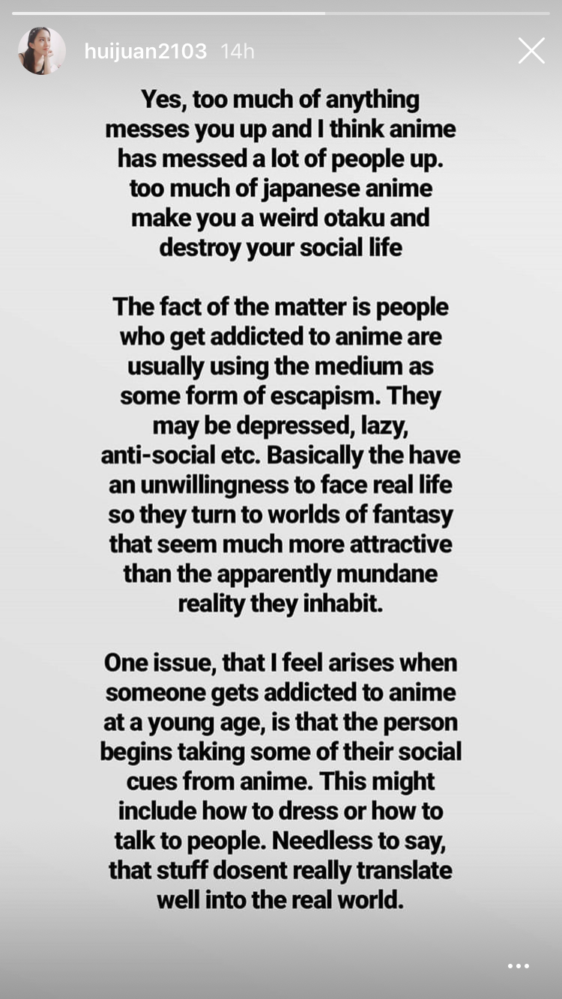
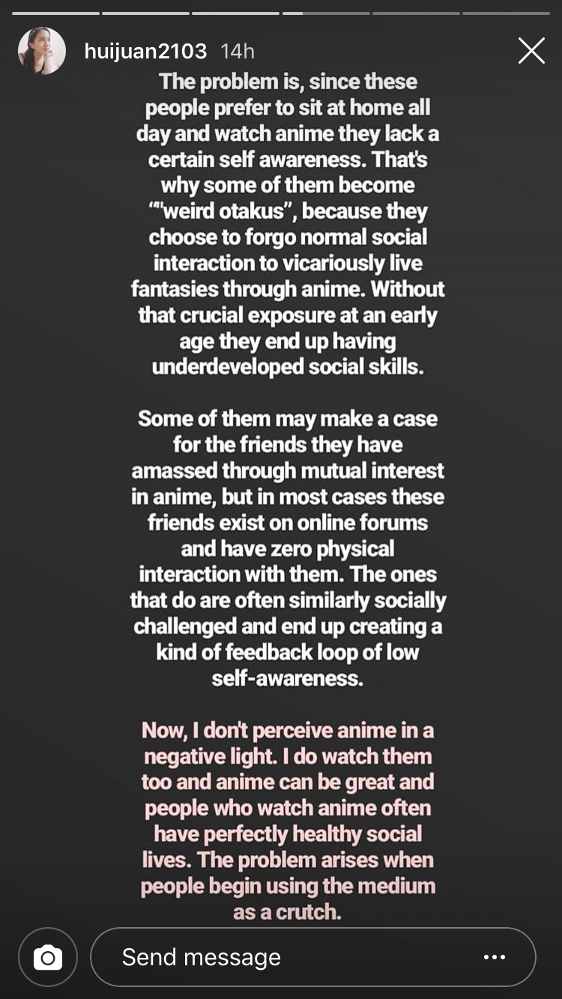
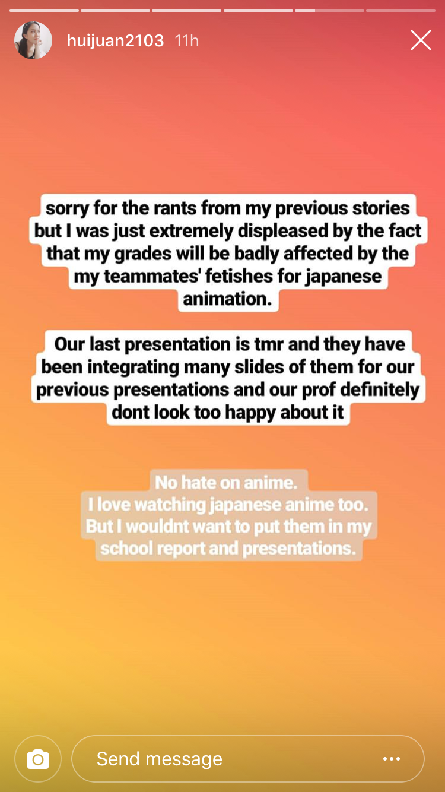
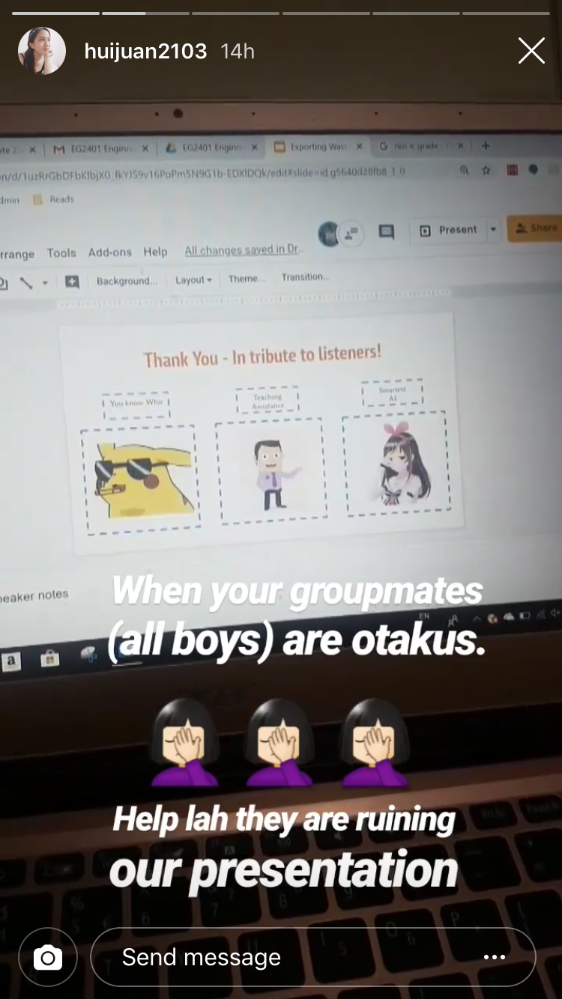
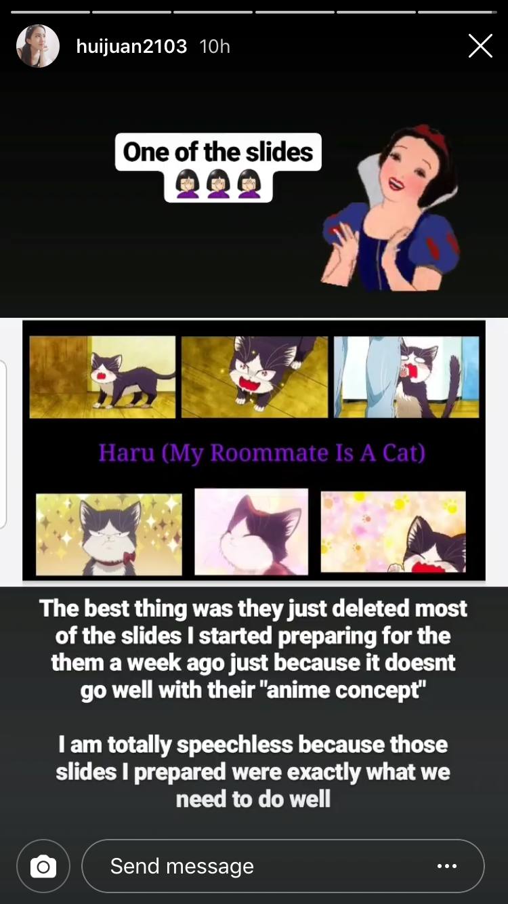
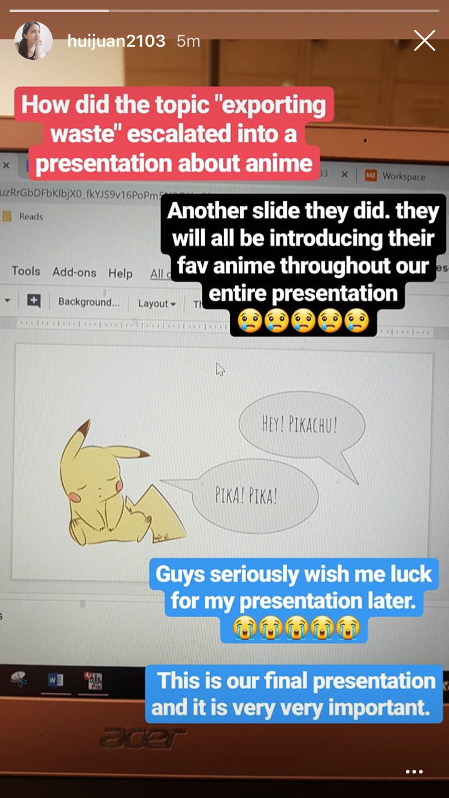
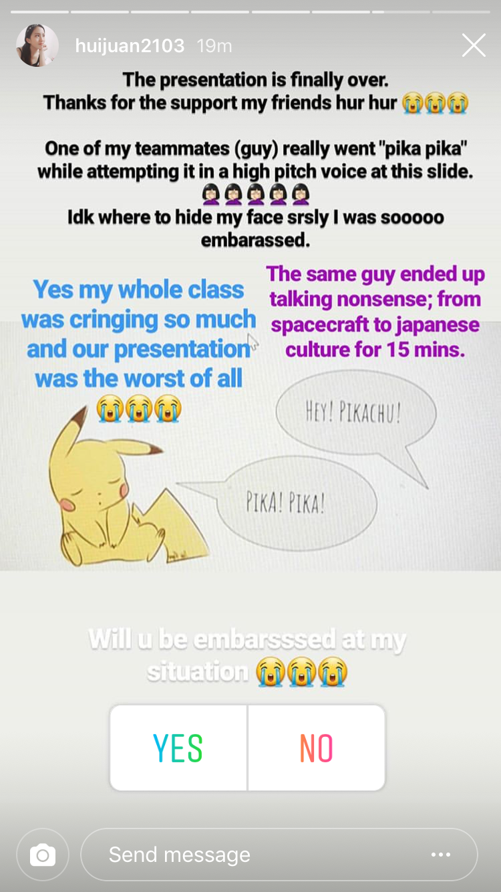
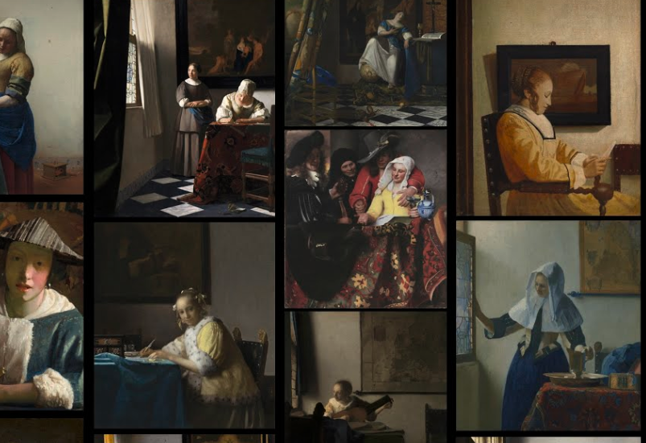

2019年4月28日

记录并分享一下我一周所看过的有趣的网页和见闻。

## 当你的项目队友是死忠粉

我的一个EE学妹即将迎来她的presentation答辩，然而她发现自己的队友都是动漫狂热粉,对此她形容为"fetishes for Japanese anime"。无奈的她只能在自己的instagram story里描述了一通自己的与他们合作期间的“惨痛经历”。

## 攀岩的最高境界

[How I climbed a 3,000-foot vertical cliff — without ropes](https://www.ted.com/talks/alex_honnold_how_i_climbed_a_3_000_foot_vertical_cliff_without_ropes/transcript)

经常去大学游泳池的我总是会路过University Sports Hall攀岩那里，而且我能见到一大帮攀岩俱乐部的人，据我观察他们好像一周起码有四天都有在一起攀岩。哇怎么有这么多人一起这么勤劳的玩这个攀岩，我大一的时候也有一门RVRC的课给我们请了攀岩老师教我们攀岩，但好像也没这么好玩吧？出于好奇我在网上搜了下关于攀岩的信息，然后看到了这个视频。

极限运动视频里那些徒手攀岩，不带任何保护器械的人并不是随随便便就能爬巨峰的。这位从孩童时期就开始练习，已经有二十年攀岩经历的大哥也是多次反复爬了El Capitan，才终于敢丢下器械放手一爬的。不过，也许这位攀岩大哥更紧张的是帮他记录过程的摄像师好友们。看了这个[视频](https://www.youtube.com/watch?v=3-wjmIFlnNo)你就体会到他们紧张的心情，因为尽管经验丰富，这位大哥还是随时有可能就会像国内的那位[吴永宁](https://baike.baidu.com/item/%E5%90%B4%E6%B0%B8%E5%AE%81/22246529)一样坠下一去无回。

<em>“Climbing Half Dome had been a big goal and I did it, but I didn't get what I really wanted. I didn't achieve mastery. I was hesitant and afraid, and it wasn't the experience that I wanted. But El Cap was different. With 600 feet to go, I felt like the mountain was offering me a victory lap. I climbed with a smooth precision and enjoyed the sounds of the birds swooping around the cliff. It all felt like a celebration. And then I reached the summit after three hours and 56 minutes of glorious climbing. It was the climb that I wanted, and it felt like mastery. ”</em>  
 ---- Alex Honnold 

## 不一般的赏画网站 

[The complete works Vermeer's 36 paintings all in one place](https://artsandculture.google.com/project/vermeer-paintings)

当时在巴黎逛卢浮宫时第一次感受到了无数幅巨大油画所带来的震撼。然而美中不足的是每幅画下的注释里的信息有些太少，让我这样的理工男吃瓜群众实在不知道怎样去品味画的魅力所在。这个网站通过利用高清的图像，网页javascript的自动放大和更加细微的描述，让我更好的品味和认识到了这些油画的细节，背景故事和作画的精妙所在。

(手机也能正常浏览，但当然比不上电脑。如果你有个外接大屏幕，观赏效果更佳)

## 小黄球过关

[The Lucky Yellow Marble](https://youtu.be/ytV76_ZWprQ)

看后能感到非常满足的小黄球障碍关卡，绝对能让强迫症患者上瘾，这是要经过多少次失败才能设计和通过这些也靠运气的关卡啊。

## 蛋黄和蛋白是如何演变成小鸡的？
[Observation of the Development of Chick Embryo](https://youtu.be/uE0uKvUbcfw)

想像一下你有一个刚刚受精过的鸡蛋，假如你能透视蛋壳的话，你会不会很想去观察一直蛋黄是怎样发育成一只小鸡呢？这个视频中，作者用保鲜纸简单模拟了一个人工蛋壳内环境，配合孵化器来维持一定的温度，蛋白和蛋黄能照常孕育出小鸡。然后就进行了三周的观察和拍摄，直到第22天就是孵化日，一个活蹦乱跳的小鸡就出来了。

## 启发
[7 Crucial Lessons People Often Learn Too Late in Life](https://youtu.be/WbvdOuo9pkc)

1. Doing what you love to do is a privilege, not an expectation. If you want to do what you love, you potentially have to work 3 times as hard to fight for it.

2. Habit shapes who you are. Habits start from a change of action. If this action is replicated over a week, you may notice a slight difference; if this action is replicated over a year, then you may not even recognise yourself any more.

3. The best ideas come through ease, the best flows happen in moments of joy.
